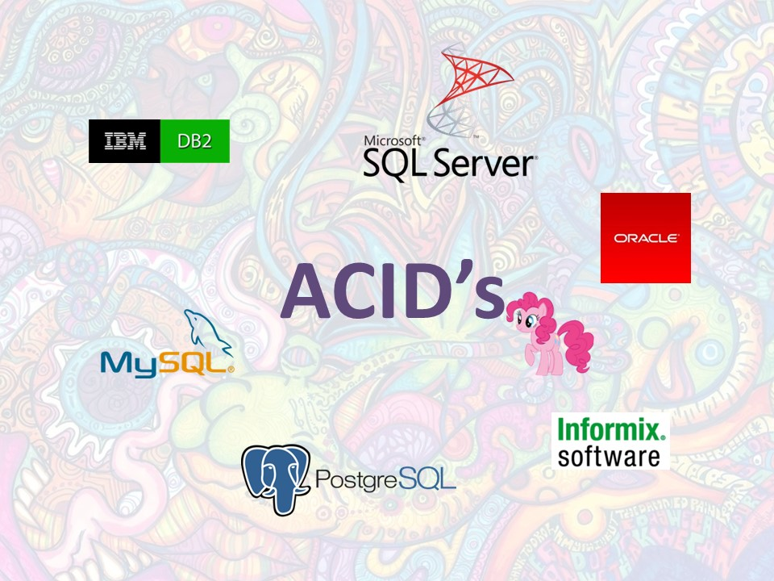
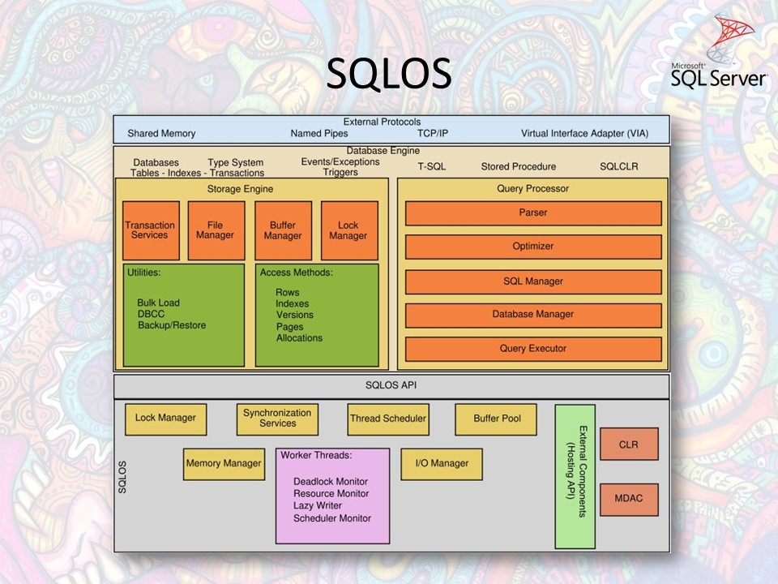
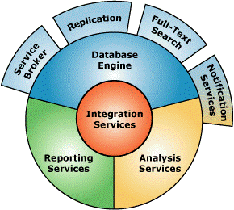
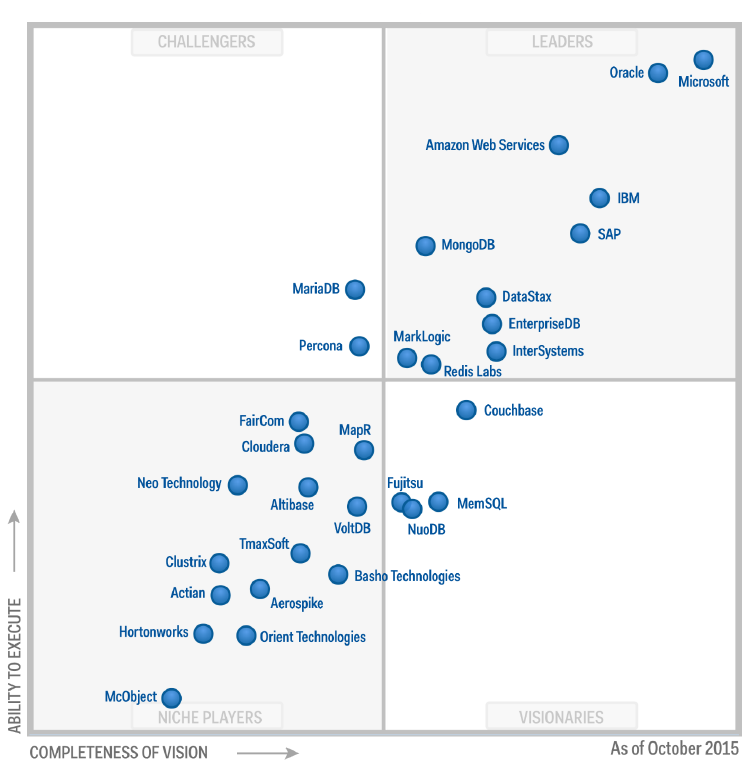
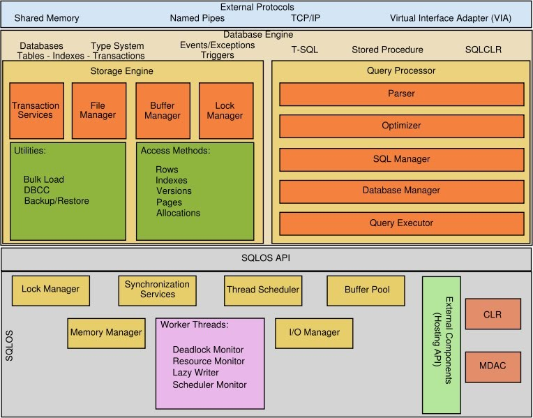

# Bancos de Dados ACID e Sistemas Operacionais

**ACID Database Management Systems with Operational Systems. UFABC 2Q/2016 - Operational Systems Class.**

Universidade Federal do ABC - Bacharelado em Ciência da Computação  
Sistemas Operacionais 2016/Q2

# Apresentação

### [Apresentação completa](./docs/ApresentacaoBancosdedadoseSOs.ppsx)

**As demonstrações usadas na apresentação estão na pasta /docs/sql-demos**

# Relatório

## Bancos e Sistemas

Sistemas gerenciadores de bancos de dados têm algumas estruturas bastante semelhantes das vistas em sistemas operacionais, e implementam boa parte das técnicas de interação com o sistema aprendidas no curso, o objetivo do relatório é comparar suas estruturas de blocos, mostrar essas semelhanças e indicar algumas boas práticas de ambiente com reflexo na performance do banco de dados.

Dado os sistemas gerenciadores de bancos de dados (SGBD’s) terem estruturas muito semelhantes entre si entre diferentes fornecedores, sejam o SQL Server da Microsoft, o DB2 ou o Informix ambos da IBM, o Oracle xg e o MySQL ambos da Oracle, apesar de usarmos aqui o banco multiplataforma SQL Server, as técnicas em especial no sentido de I/O podem ser consideradas em qualquer destes SGBD’s que tenham aderência ao ACID, mas com implementação em nível de código distinta. A versão do banco utilizada foi a “SQL Server 2016 Developer Edition” que é gratuita para desenvolvimento e a última disponível na confecção do relatório.

## O que é um SGBD e o que é ACID?

### SGBD

Um sistema gerenciador de banco de dados ou SGBD (do inglês DBMS - Data Base Management System) é um conjunto de aplicações responsável por gerenciar um armazenamento de dados, e permitir a outros aplicativos consultar e manipular dados.
No nosso caso, vamos nos ater a SGBD’s relacionais ou seja, que são capazes de manter e forçar políticas de relação de chave entre tabelas de dados respeitando relacionamentos 1-para-muitos ou 1-para-1 por exemplo entre seus dados. Mas vou comparar rapidamente suas características com sistemas NoSQL (do inglês Not Only SQL.

### ACID

ACID é o acrônimo de Atomicidade, Consistência, Isolamento e Durabilidade (do inglês ACID - Atomicity, Consistency, Isolation and Durability) que é um conceito geralmente ligado ao conceito de transação num SGBD. Transação num SGBD pode ser entendida como um conjunto de comandos de manipulação de dados ou alteração de esquema que devem ser executadas pelo SGBD.

- **Atomicidade** - Trata o conjunto de comandos da transação como indivisível, ou todos são executados ou os dados são mantidos como se a transação nunca tivesse ocorrido, os dados e esquema não devem ficar em estados intermediários (geralmente “commit” no caso de sucesso ou “rollback” para reverter);
- **Consistência** - A transação deve levar os dados de um estado consistente a um estado consistente com relação ao esquema, todas as políticas com relação a tipo ou relação por exemplo devem ser respeitadas;
- **Isolamento** - As transações paralelas num sistema multiusuário não interferem umas nas outras, transações diferentes não “veem” os estados intermediários dos dados de uma outra transação sendo executada nos seus dados;
- **Durabilidade** - Os efeitos de uma transação bem sucedida devem ser persistentes mesmo em casos de falha do próprio SGDB, do sistema ou hardware.

## O que é o SQL Server?

O SQL Server é um sistema SGBD desenvolvido atualmente pela Microsoft, foi criado em 1988 pela Sybase para a plataforma OS/2, e em 1994 a Microsoft assumiu o desenvolvimento do produto. Ele é completamente aderente ao ACID e trabalha com o padrão ANSI SQL, mas o estende num dialeto específico chamado T-SQL. Sua versão 2014 foi a última a suportar plataforma 32bits e a versão atual 2016 será a primeira lançada também para sistemas operacionais Linux.

Uma importante virada no produto SQL Server ocorreu em novembro de 2005 quando foi lançado o SQL Server 2005 codenome “Yukon”, onde foram incluídos com uma visão mais completa de produtos “na caixa” do mecanismo de dados outros serviços, sendo os principais:

- Database Engine - É o mecanismo de núcleo para armazenamento, processamento e segurança dos dados (no sentido de autorização e recuperação). Ele é usado para criar armazenamentos de dados para OLTP ou OLAP;
- Analysis Services - Mecanismo para criação de “datawarehouses” e “datamarts” um tipo específico de armazenagem de dados otimizado para análise organizados em cubos OLAP, e ferramentas de mineração de dados “data minning”;
- Integration Services - É o mecanismo de ETL (Extract, Transform, Load) da plataforma, é possível integrar e transformar dados de diferentes plataformas e formatos com ele. Até a versão 2005 ele se chamava DTS (Data Transformation Services;
- Reporting Services - Uma plataforma de desenvolvimento, gerenciamento e distribuição de relatórios interativos, formato papel, tabular ou painéis (Dashboards) que podem ser consumidos na plataforma, entregues para agendamento ou consumidos por API’s multiplataforma.

  
Serviços do SQL Server a partir da versão 2005

Os componentes adicionais são essenciais a estruturas de tomada de decisão (DSS - Decision Support Systems) e de inteligência de negócios (BI - Business Intelligence).
A inclusão destes serviços na plataforma diminuiu drasticamente o custo de aquisição do produto, visto que os concorrentes disponibilizavam (e ainda disponibilizam) plataformas BI, OLAP e ETL licenciadas em separado e em alguns casos com custo semelhante ao do mecanismo de dados. 

Dez anos após esse lançamento estamos na versão 2016 do produto e esse posicionamento agressivo foi um fator decisivo para colocá-lo em destaque no último levantamento da Gartner sobre SGDB’s conhecido popularmente como “quadrante mágico” frente aos concorrentes mais diretos.

  
Quadrante mágico da Gartner para Outubro de 2015 em DBMS’s. Importante notar que eles consideraram bancos não ACID neste levantamento.

## Estrutura de um OS X Estrutura do SQLOS

No passado a escalabilidade do SQL Server sempre foi questionada quando entravam em cena volumes transacionais muito grandes ou bancos de dados muito massivos. O mercado classificou o produto como um SGBD capaz de gerenciar volumes de dados de pequeno e médio porte devido limitações de seu mecanismo. Esse retorno de mercado levou a equipe de desenvolvimento a uma profunda alteração na engenharia do produto: A criação do SQLOS ou sistema operacional do SQL Server.
Resumidamente, o SQLOS é uma camada fina de software rodando em modo de usuário entre o SQL Server e o Windows. Ela é usada para operações de baixo nível como agendamento, entrada/saída, gerenciamento de memória e de recursos.
CPU

  
Diagrama de blocos do SQL Server e do SQLOS

## CPU (Agendadores escalonamento e threads)

O SQL Server pode rodar em modo thread ou fibra (thread mode, fiber mode) sendo o padrão o modo thread, o modo fibra é um modo de pool mais leve mas só recomendado em situações específicas.

Os elementos desse processo de trabalho são:

- Agendadores (Schedulers) - No inicio do serviço, o SQL Server reserva um agendador (scheduler) para cada processador lógico no sistema*. Ele controla a execução das requisições e não substitui o agendador do Windows, mas gerencia a execução sem retornar o controla para ele, o que diminui significativamente as trocas de contexto. Ele opera de modo não-preemptivo, uma vez que as requisições têm a obrigação de devolver o controle para o agendador quando termina seu tempo de CPU ou são suspensas;
    - Agendadores podem ser monitorados pela view dinâmica de gerenciamento (DMV) sys.dm_os_schedulers;
- Trabalhadores (Workers) - O trabalhador nessa estrutura é um elemento que define uma capacidade de trabalho, ele é ligado a uma thread do sistema e é dividido em grupos (pools) associados por sua vez aos agendadores. Eles recuperam tarefas de uma lista de trabalho e cada uma delas roda até completar. Eles podem ser trocados de agendador dependendo da afinidade de CPU configurada;
    - Trabalhadores são calculados segundo o critério onde “n” é o número de CPUs lógicas no sistema:
        - Se n é menor ou igual a 4 o máximo é de 512 trabalhadores;
        - Se n é maior que 4 o máximo de trabalhadores é dado por (512 + (n - 4)*16)
    - Trabalhadores são monitorados pela view sys.dm_os_workers e threads em uso são monitorados pela view sys.dm_os_threads;
- Tarefas (Tasks) - Tarefas são executadas quando retiradas de uma fila de trabalho (work queue) de modo não-preemptivo o que novamente denota o modelo cooperativo do SQL Server. Elas são atribuídas a um agendador
Diagrama de blocos do SQL Server e do SQLOS
(para serem executadas por um trabalhador de seu grupo) baseada em NUMA, configurações de afinidade ou balanceamento de carga por pressão relativa nos agendadores**;
    - Tarefas podem ser monitoradas pela view sys.dm_os_tasks, a view sys.dm_os_waiting_tasks que informa as tarefas esperando por um recurso qualquer;

Nota*: Na verdade, o SQL Server mostra dois agendadores por CPU, sendo que um deles é reservado para tarefas internas e o outro para execução de requisições, mais um na CPU zero para conexões administrativas diretas, usada somente em casos especiais para correções mais críticas. Para nosso escopo de compreender o agendamento, pode ser interessante simplificar em um por CPU.

Nota**: Antes do SQL 2005, o agendador do SQL Server trabalhava no conceito de round-robin, e a tarefa não tinha garantias de ser agendada num agendador sub-utilizado. Essa característica afetava o mecanismo a ponto de tornar desafiadores trabalhos volumosos OLTP ou OLAP.

Simplificadamente o plano de execução é:

1. O usuário conecta ao mecanismo;
2. O usuário executa comandos;
3. Os comandos são divididos em uma ou mais tarefas (no caso de paralelismo ser necessário);
4. Cada tarefa é atribuída a um trabalhador;
5. O agendador “agenda” o trabalhador para execução;
6. O trabalhador entra nos estados RUNNING, RUNNABLE ou SUSPENDED;
7. A tarefa é concluída;

### [Relatório completo](./docs/RelatorioBancosdedadoseSOs.pdf)

## Referências

Pasta /docs/references
